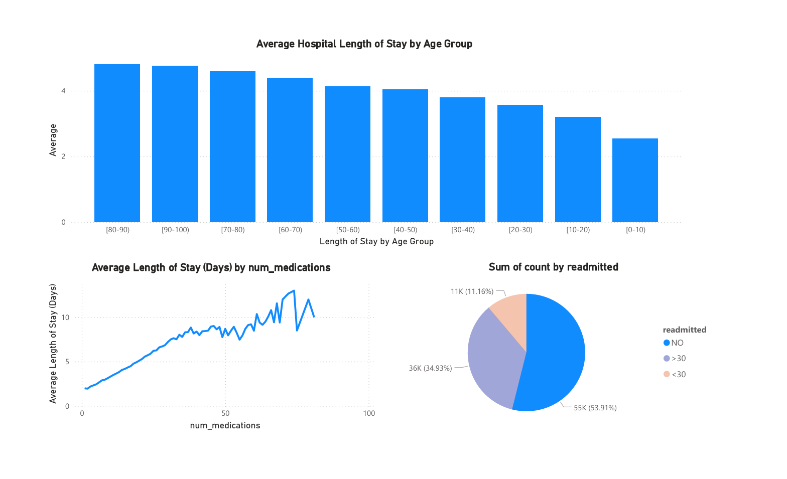

# Healthcare Analytics: Hospital Readmission & Length-of-Stay Analysis

### Healthcare Data Science & Analytics Project

This project analyzes hospital **length-of-stay trends and 30-day readmission patterns** using a U.S. clinical dataset containing **100,000+ patient encounters across 130 hospitals**.  

The goal of the analysis is to demonstrate how **healthcare analytics and predictive modeling** can help hospitals identify high-risk patients, understand operational drivers of hospital stays, and improve care outcomes while reducing unnecessary costs.

The project combines **Python predictive modeling**, **R data processing**, and **interactive dashboards built in Power BI and Tableau** to explore patient risk patterns and hospitalization trends.

---

# Power BI Dashboard – Length of Stay Analysis

This dashboard focuses on **hospital operational analytics**, analyzing the factors that influence how long patients remain hospitalized.

Key drivers analyzed:

- Age group vs average hospital length of stay  
- Medication complexity vs hospitalization duration  
- Readmission status vs length of stay  
- Estimated hospitalization cost impact

The dashboard demonstrates how healthcare organizations can use analytics to identify **efficiency opportunities and cost drivers**.

---

# Tableau Dashboard – Hospital Utilization Trends

An interactive **Tableau dashboard** was created to further explore hospital utilization patterns and operational insights.

Key factors analyzed:

- Patient age vs length of stay  
- Readmission status vs hospitalization duration  
- Medication complexity vs hospital stay length  

This dashboard highlights how analytics tools like Tableau can support **healthcare operational decision-making and resource planning**.

---

# Predictive Modeling: Hospital Readmission Risk

Hospital readmissions are a major cost driver in healthcare. Predictive analytics can help hospitals identify **high-risk patients before discharge** and improve care coordination.

Using Python, this project analyzes factors associated with hospital readmission and builds a **logistic regression model** to estimate readmission probability.

Steps included:

- Healthcare data cleaning and preprocessing
- Exploratory data analysis (EDA)
- Feature selection
- Logistic regression modeling
- Visualization of high-risk patient groups

---

# Tools & Technologies

- **Python** (Pandas, NumPy, Scikit-learn)
- **R** (data preparation and statistical analysis)
- **Power BI** (interactive dashboard development)
- **Tableau** (data visualization and operational dashboards)
- **Data Visualization** (Matplotlib)

---

# Key Insights

Analysis of **100,000+ hospital encounters** revealed several patterns in patient outcomes:

- Length of stay increases steadily with older age groups
- Higher medication counts correlate with longer hospital stays
- Readmission risk increases significantly for patients over age 70
- Certain diagnosis groups show higher readmission probability

These findings demonstrate how healthcare analytics can help hospitals **identify high-risk populations and reduce avoidable readmissions**.

---

# Data Visualizations

### Readmission Rate by Age

### Readmission Rate by Race

### Diagnoses with Highest Readmission Rates

---

# Project Files

- `healthcare_length_of_stay_dashboard.pbix` – Power BI dashboard
- `hospital_analysis.R` – R analysis for LOS metrics
- `premier_readmission_project_starter.py` – Python readmission modeling
- `diabetic_data.csv` – healthcare dataset

