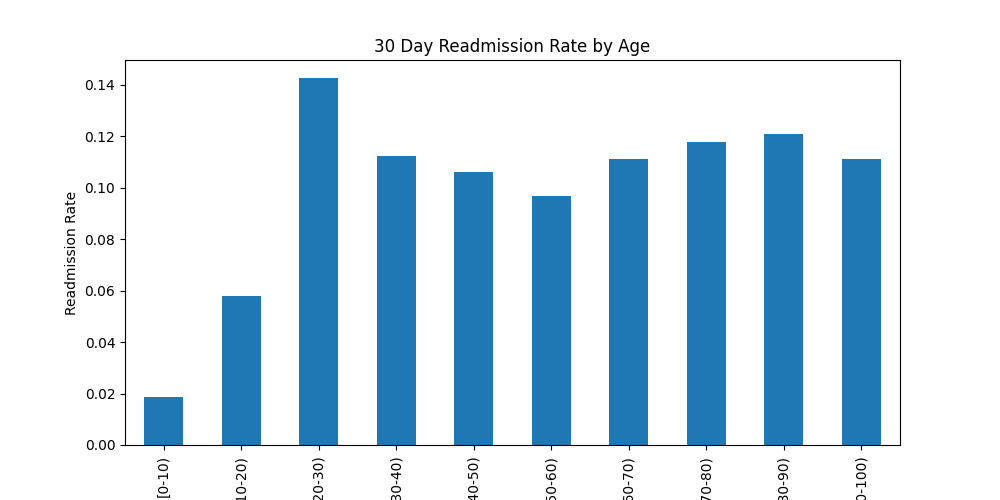
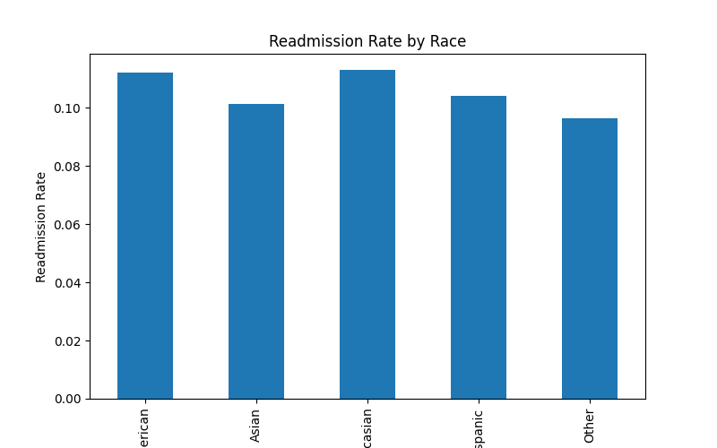
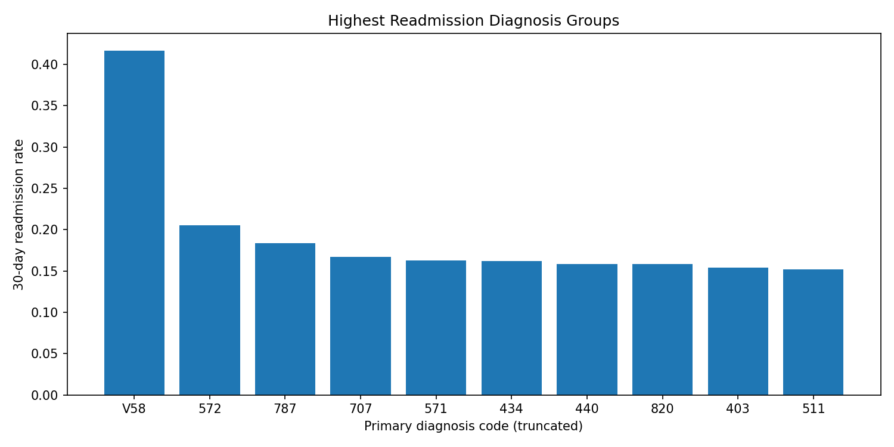

# Hospital Readmission Project

This is a portfolio project designed to match the kind of healthcare analytics Premier asked for:
- healthcare data analytics
- relational databases
- Python
- model research / development support

## Key Insights

Analysis of 100,000+ U.S. hospital encounters revealed several patterns in 30-day hospital readmission risk.

• Readmission rates increase significantly for patients over age 70  
• Certain diagnosis groups show much higher readmission probability  
• Demographic differences appear but are smaller than diagnosis effects  

These findings demonstrate how healthcare data analytics can help hospitals identify high-risk patients and reduce avoidable readmissions.

## Data Visualizations

### Readmission Rate by Age

### Readmission Rate by Race

### Diagnoses with Highest Readmission Rates

